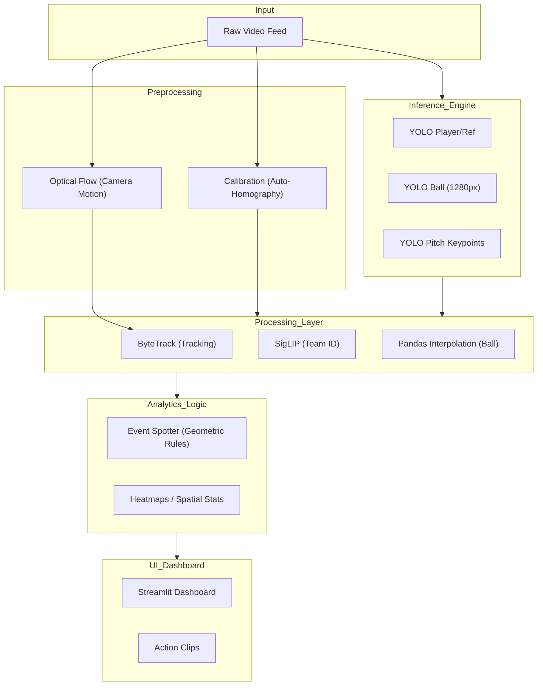

# Technical Analysis Report: EDudin Football Analytics

## 1. Project Overview
**EDudin Football Analytics** is a high-performance computer vision system designed for the automated analysis of football (soccer) matches from video feeds (broadcast or wide-angle VEO).

*   **Purpose**: To transform raw video into actionable tactical data without manual intervention.
*   **Problem Solved**: Bridge the gap between low-level video data and high-level tactical insights (heatmaps, possession, event spotting).
*   **System Type**: A full-stack AI system combining **Computer Vision**, **Object Tracking**, **Spatio-Temporal Event Detection**, and **Data Analytics**.

## 2. Project Architecture
The project follows a modular pipeline architecture:

**Pipeline**:
`Input (Video) → Preprocessing (Optical Flow/Calibration) → Multi-Model Inference (YOLO) → Tracking (ByteTrack) → Classification (SigLIP) → Transformation (Homography) → Output (Dashboards/JSON)`

### Main Modules:
*   [video_processor.py](file:///c:/D/EDApp/app/modules/video_processor.py): The orchestrator. Manages sampling, frame iteration, and data aggregation.
*   [detector.py](file:///c:/D/EDApp/app/modules/detector.py): A specialized detection engine using three distinct models:
    - **PLAYER_MODEL**: Detects players, referees, and goalkeepers at standard resolution.
    - **BALL_MODEL**: Runs at 1280px resolution to catch tiny balls (~8px) in wide-angle shots.
    - **PITCH_MODEL**: pose-based model for automatic field keypoint extraction.
*   [tracker.py](file:///c:/D/EDApp/app/modules/tracker.py): Implements a professional-grade ByteTrack algorithm with **Camera Motion Compensation** via Optical Flow.
*   [calibration_pnl.py](file:///c:/D/EDApp/app/modules/calibration_pnl.py): Handles the perspective transformation (Homography) from pixels to meters.

## 3. Technologies Used
*   **Deployment**: `Streamlit` (UI/Dashboard).
*   **AI Frameworks**: `Ultralytics YOLOv8` (Object detection/pose), `PyTorch` (Base DL).
*   **Computer Vision**: `OpenCV` (Preprocessing), `Supervision` (Annotation/Analytics/Tracking).
*   **Classification**: `Transformers` ([SigLIP](file:///c:/D/EDApp/app/modules/detector.py#342-395)), `UMAP` (Dimensionality reduction), `Scikit-learn` (`KMeans`).
*   **Data Processing**: `Pandas` (Trajectory interpolation), `NumPy`.

## 4. Dataset Analysis
The project uses a YOLOv8-format dataset ([data.yaml](file:///c:/D/EDApp/ml/training/data.yaml)):
*   **Structure**: `images/` and `labels/` folders (txt files).
*   **Classes**: [player](file:///c:/D/EDApp/app/modules/video_processor.py#451-486), [goalkeeper](file:///c:/D/EDApp/app/modules/detector.py#408-420), `referee`, [ball](file:///c:/D/EDApp/app/modules/detector.py#79-91).
*   **Suitability**:
    - **Object Detection**: High (multi-model approach handles small objects).
    - **Tracking**: Excellent (temporal continuity provided by ByteTrack).
    - **Tactical Analysis**: High (supports homography for real-world metrics).
    - **Event Detection**: Moderate (mostly rule-based currently, skeleton for T-DEED exists).

## 5. Model Analysis
*   **YOLOv8x / YOLOv11**: Likely used for detection (based on `best_football_seg.pt` and `detect_players.pt`).
*   **SigLIP (Vision Transformer)**: Used as a feature extractor for team classification. This is a SOTA approach far more robust than simple RGB clustering.
*   **Loss Functions**: YOLO uses a combination of CIoU (box) and Binary Cross-Entropy (class).
*   **Inference Strategy**: [detect_frame_kaggle](file:///c:/D/EDApp/app/modules/detector.py#150-204) uses image scaling for the ball, which is a key industrial practice for wide-angle video (VEO).

## 6. Football Analytics Capabilities
*   **Detections**: Players, Ball, Referees, Goalkeepers, Teams (via color/SigLIP).
*   **Analytics**:
    - **Heatmaps**: Spatial density of player movements.
    - **Ball Events**: Automatic detection of Pass, Shot, Dribble, Recovery.
    - **Physics-based Filtering**: Uses max velocity rules to discard 150km/h+ ball "jumps" (noise).
    - **Automatic Homography**: Pitch pose estimation for real-world (105x68m) mapping.

## 7. Code Quality Review
*   **Strengths**:
    - **Modularity**: Separation between UI, Processing, and ML.
    - **Cleanliness**: Extensive use of docstrings and clear variable names.
    - **Robustness**: Handling of interpolation (Pandas) and camera motion (Optical Flow).
*   **Weaknesses**:
    - **Hardcoded Paths**: References to `c:/apped` and `c:/D/EDApp` should be abstracted to environment variables.
    - **Skeletons**: `IdentityReader` and `EventSpotterTDEED` are currently skeletons/wrappers and lack the full implementation of the models.

## 8. Missing Components (Professional Level)
*   **Dorsal Number OCR**: Current `IdentityReader` is a skeleton; lacks a robust OCR (like PARSeq) for player IDs.
*   **Event Classification**: Relies on geometric rules (speed/direction); needs a full 3D ConvNet or Transformer for action recognition.
*   **Real-time Streaming**: Currently optimized for file processing; lacks RTSP/SRT ingress support.
*   **Persistence**: Database for match history (PostgreSQL/MongoDB).

## 9. Potential Improvements
*   **GPU Acceleration**: Move Optical Flow to CUDA.
*   **Data Augmentation**: Use Mosaic/Mixup specifically for small object (ball) detection.
*   **Calibration**: Multi-view calibration if multiple cameras are available.
*   **Smarter Interpolation**: Use Gaussian Processes or Kalman Filters for ball trajectory prediction when occluded.

## 10. Research-Level Improvements
*   **Multimodal Learning**: Use audio (whistle, ball strike) + video for event spotting.
*   **Spatio-Temporal Transformers**: Implement **VideoMAE** or **TimeSformer** for full match activity recognition.
*   **Identity Re-ID**: Use appearance embeddings (Re-ID) to persist player identity across occlusions more robustly than ByteTrack.

## 11. System Diagram

## 12. Final Evaluation
*   **Strengths**: Extremely well-engineered for "wild" video (VEO/Broadcast). The multi-model detector and SigLIP classifier are industry-level solutions.
*   **Weaknesses**: Several modules are still in "skeleton" phase (Action recognition, OCR).
*   **Scalability**: High. The containerized-ready structure and modular ML engine allow for easy scaling to cloud-based batch processing.
*   **Real-world Applicability**: Fully viable for semi-pro and amateur team analysis (Hudl/Wyscout competitor level).
